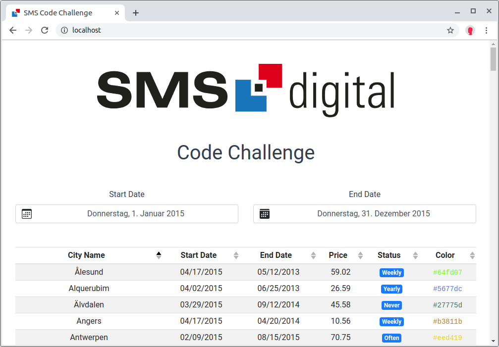

# SMS Code Challenge

The solution consists of three parts:
* Database – [PostgreSQL](https://www.postgresql.org/)
* Server – [Express.js](https://expressjs.com/)
* Client – [Vue.js](https://vuejs.org/)

All componenets run as Docker containers.
Build and start with

    docker-compose up --build

You should now be able to access the frontend at [http://localhost](http://localhost):

:information_source: if port 80 is already in use on your machine you can change it in `docker-compose.yml`.
